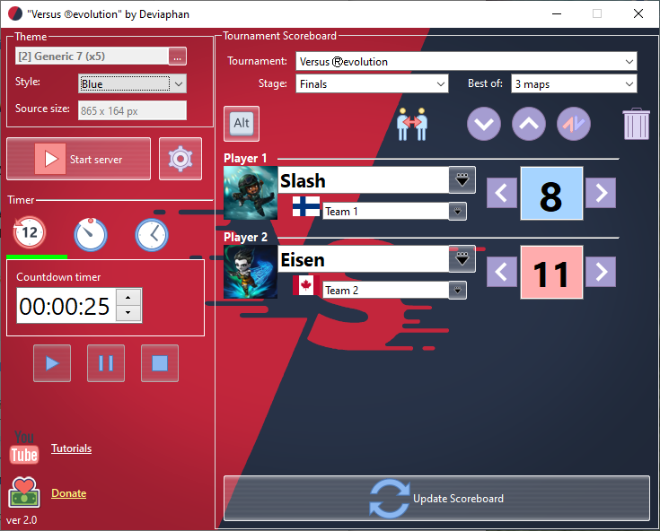
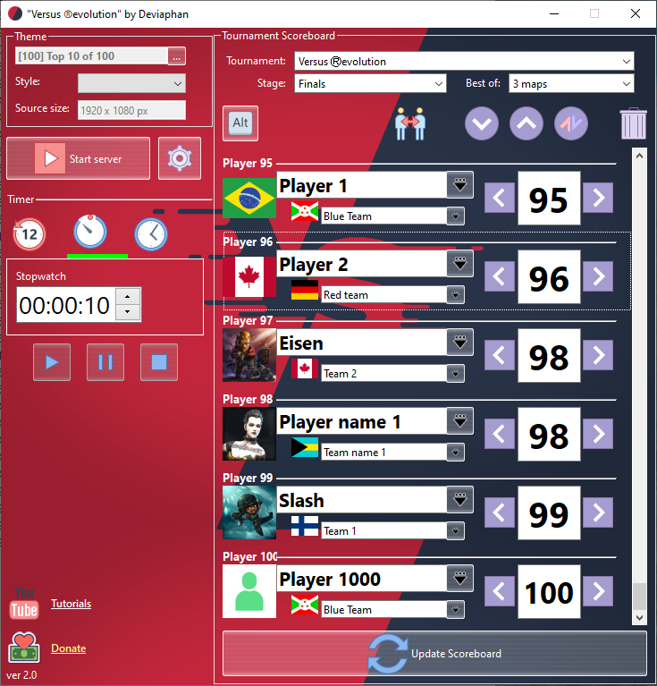
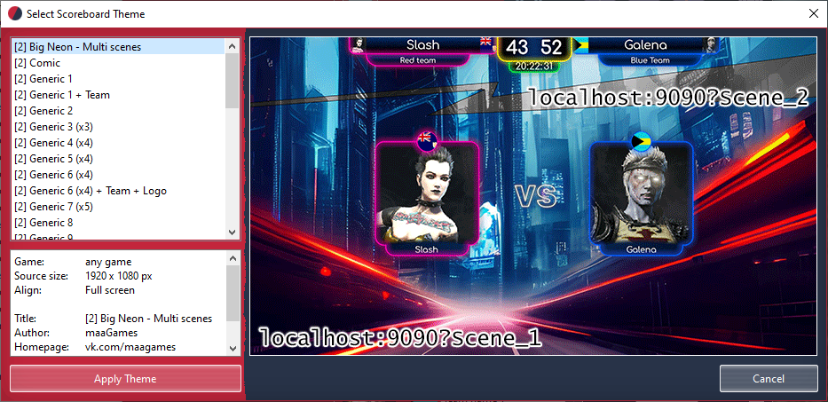
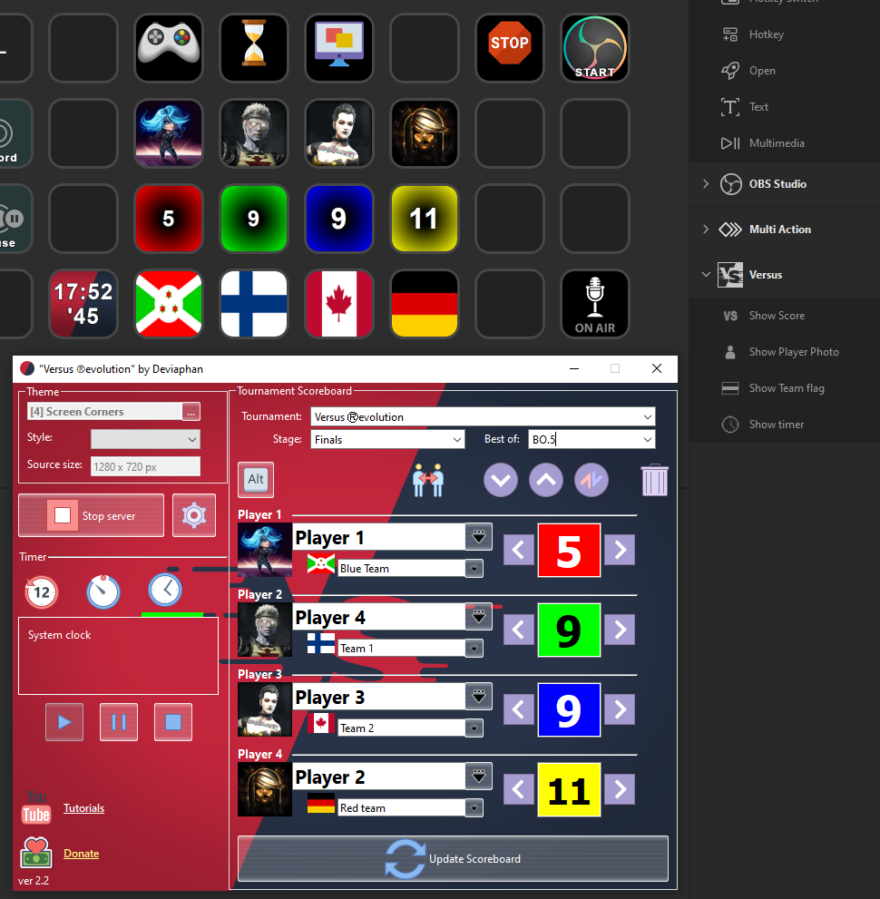

#  Versus Ⓡevolution OBS scoreboard

:link: [Download Versus](https://obsproject.com/forum/resources/versus-%E2%93%87evolution-scoreboard.1339/)

:moneybag: [donate boosty.to](https://boosty.to/deviaphan/donate)

:moneybag: [donate dotanion alerts](https://www.donationalerts.com/r/deviaphan)

## :vs: Description

A scoreboard overlay to your live stream. You can create own themes for any games with simple html5/css3 files.

[Step-by-step instructions](https://www.youtube.com/playlist?list=PLrDj8U_8sp4aYoa0HHlYmRGhgbXxkQehn "Step-by-step instructions")  for adding a scoreboard overlay to your live stream:

- [Quick start](https://www.youtube.com/watch?v=0_DQaQC1QyE&list=PLrDj8U_8sp4aYoa0HHlYmRGhgbXxkQehn&index=2 "Quick start")
- [Player photo and Team flag](https://www.youtube.com/watch?v=y-woAD0lwzw&list=PLrDj8U_8sp4aYoa0HHlYmRGhgbXxkQehn&index=3 "Player photo and Team flag")
- [Fix OBS problem: Refresh cache](https://www.youtube.com/watch?v=j_hpa7rqCuU&list=PLrDj8U_8sp4aYoa0HHlYmRGhgbXxkQehn&index=3 "Fix OBS problem: Refresh cache")
- [Add custom photo/logo/flag](https://www.youtube.com/watch?v=DF7jZhh4W5Q&list=PLrDj8U_8sp4aYoa0HHlYmRGhgbXxkQehn&index=4 "Add custom photo/logo/flag")
- [How to support development](https://www.youtube.com/watch?v=4lyMKFcCPRE&list=PLrDj8U_8sp4aYoa0HHlYmRGhgbXxkQehn&index=5 "How to support development")
- [Timer, Stopwatch, Clock](https://www.youtube.com/watch?v=VpCezI5eUL0&list=PLrDj8U_8sp4aYoa0HHlYmRGhgbXxkQehn&index=6 "Timer, Stopwatch, Clock")
- [Use player group](https://www.youtube.com/watch?v=VcBaS2vFTj0&list=PLrDj8U_8sp4aYoa0HHlYmRGhgbXxkQehn&index=7 "Use player group")
- [Edit hotkeys](https://www.youtube.com/watch?v=umEVN3yGen0&list=PLrDj8U_8sp4aYoa0HHlYmRGhgbXxkQehn&index=8 "Edit hotkeys")
- [install Elgato Stream Deck plugin](https://www.youtube.com/watch?v=nL32ae0itxA&list=PLrDj8U_8sp4aYoa0HHlYmRGhgbXxkQehn&index=9 " install Elgato Stream Deck plugin")

## :white_check_mark: Features
- any number of players
- ability to set a player photo and team flag
- hotkeys
- ability to change the order of players (sort ascending, sort descending, flip list)
- save and restore groups of players
- support countdown timer, stopwatch and system clock :clock10:
- elgato Stream Deck plugin

